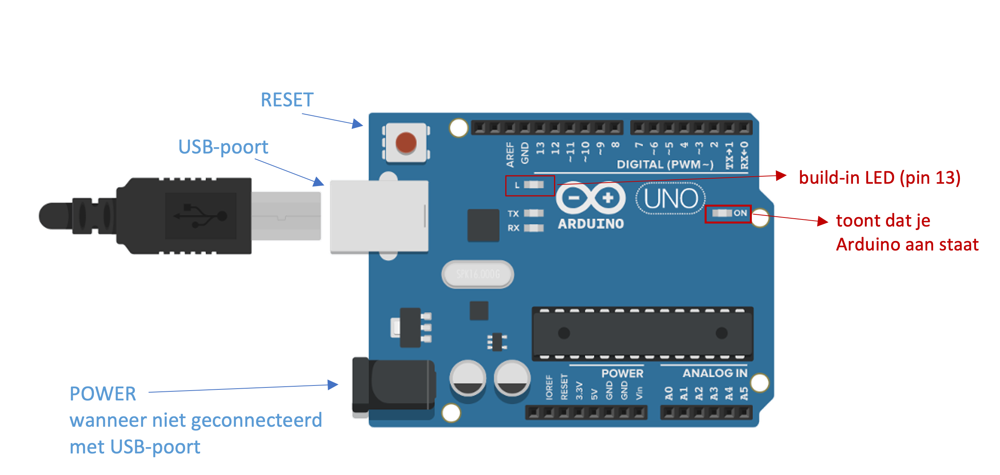
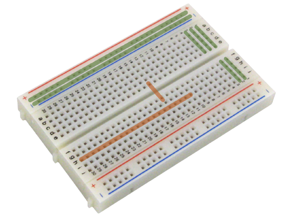
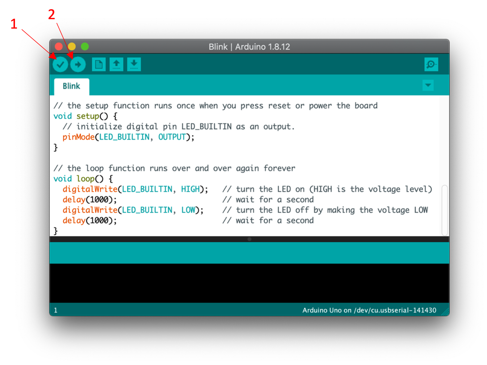

## Arduino: wat?

Een Arduino is een microcontroller. Er zijn vele versies, de versie waarmee wij gaan werken is de UNO. Deze is ideaal voor beginners, maar heeft toch heel erg veel mogelijkheden!
Naast de microcontroller heb je ook een programmeeromgeving nodig: de Arduino IDE. Deze is open-source (kan je gratis downloaden via <https://www.arduino.cc/en/software>) en kan je op zowel Windows, Linux als MacOS installeren. In dit programma schrijf je je code, waarna je de code kan uploaden op een Arduino zodat deze de code kan uitvoeren. De programmeertaal die je voor Arduino code gebruikt is eigenlijk C++!

Een Arduino UNO ziet er als volgt uit:

Zoals je wel ziet zijn er veel pinnen waar je je draadjes kan insteken. We gaan hier niet in detail op in wat ze allemaal betekenen, maar de belangrijkste zijn deze:
-	5V & GND om je schakeling op je breadboard van stroom te voorzien.
-	De genummerde pinnen bovenaan op bovenstaande tekening zijn digitaal en gebruiken we als onze in- en outputs. 

De microcontroller blijft dus onderdeel van je schakeling, en stuurt al je componenten. Als je dus je Arduino permanent bij een projectje wil houden, kan je eventueel op Aliexpress of een gelijkaardige site een namaak bestellen om de kosten wat te drukken.

In heel wat situaties gebruik je je Arduino samen met een breadboardje (dat voorkomt dat je steeds moet solderen). Hierbij zijn er pinnen inwendig verbonden, steeds op een analoge manier. Bij onderstaande tekening zie je enkele groene lijnen: alle pinnen op dezelfde lijn zijn verbonden met elkaar. De pinnen aangeduid met oranje lijnen zijn voorbeelden van pinnen die *geen* verbinding maken.

Het is zeker ook handig om te weten hoe de kleurencode bij weerstanden in elkaar zit. Hier zet ik de code er voor het gemak steeds bij, maar als je zelf wilt experimenteren zal je dit wel nodig hebben.
Je kan de code zelf opstellen/ontcijferen, maar er zijn ook heel wat online websites te vinden die het werk voor jou doen, bijvoorbeeld: <https://www.digikey.be/nl/resources/conversion-calculators/conversion-calculator-resistor-color-code-4-band>.

## Een eerste projectje

Een goede manier om de verbinding met je Arduino te testen heet ‘blink’. Wij gaan dit uitvoeren op twee manieren: eerst eens met het ingebouwde LEDje op je Arduino, en daarna met behulp van componentjes op een breadboard.

Na het openen van de Arduino IDE ga je naar File > Examples > 01.Basics > Blink.
De code staat dan al klaar voor jou, en zoals je ziet zijn er nog heel wat andere stukjes code voorzien. 

Als dit nog niet gebeurd is mag je je Arduino verbinden met een USB-poort van je computer: nu zijn we klaar om de code te uploaden. Dit doe je door eerst op ‘verifiëren’ te drukken (met als symbool een vinkje), dat de code controleert op fouten, en daarna druk je op ‘uploaden’ (met als symbool een pijltje). Doe dit later ook altijd op deze manier. Het LEDje op je Arduino zou nu moeten pinken!

De delay wordt uitgedrukt in milliseconden: experimenteer eens met de delay aan te passen! Vergeet niet, na elke aanpassing moet je opnieuw verifiëren en uploaden.

Maak nu onderstaande schakeling op je breadboard.
Hou rekening met de polarisatie van het LEDje! Dit betekent dat het uitmaakt hoe de '+'-kant en de '-'-kant van het LEDje geplaatst wordt. Het langste beentje aan je LEDje is steeds de '+'-kant.
Er wordt in de afbeelding een weerstand van 220 Ohm (kleurencode rood - rood - bruin - goud) gebruikt, maar je kan hier elke waarde tussen 100 Ohm en 1000 Ohm gebruiken.

De code pas je gemakkelijk aan door de lijn `int LED = 13;` helemaal bovenaan toe te voegen (boven de setup) en door overal de `LED_BUILDIN` te veranderen naar `LED`.
Je hebt nu dus aan je programma gezegd dat er op pin 13 een component aanwezig is dat jij hebt ‘LED’ genoemd: je kan die naam dus aanpassen naar wat je zelf handig vindt, bijvoorbeeld met de kleur van je LED als je meerdere LEDs hebt.

Je kan de juiste code ook [hier](https://github.com/Jeugdwerking-FLEM/introductie-arduino/tree/main/code-1-inleiding/blink) bekijken.

Probeer als dit lukt een extra LEDje toe te voegen op pin 12: je hebt dus ook nog een extra weerstand nodig. TIP: als je een breadboard hebt met ‘+’ en ‘-‘ -lijnen dan kan je de GND samennemen op de blauwe lijn.
Wat de code betreft: je moet dus bovenaan een naam geven aan het LEDje op pin 12. Ook is één `digitalWrite()` maar voor één pin, dus je zal er wat extra moeten bijvoegen.

Probeer met een rood, oranje/geel en groen LEDje een verkeerslicht te ontwerpen!

Een mogelijke oplossing kan je [hier](https://github.com/Jeugdwerking-FLEM/introductie-arduino/tree/main/code-1-inleiding/verkeerslicht) vinden.
