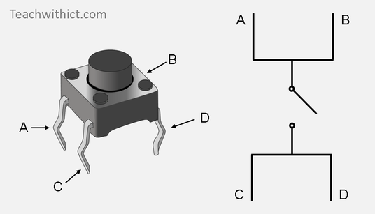

## De Drukknop

In dit gedeelte leer je een LEDje bedienen met een drukknop. Het type drukknop die wij gaan gebruiken heeft 4 pinnen - A en B zijn altijd verbonden, net als C en D. Je kan dus de pinnen A of B met C of D gebruiken als onderbreking. Wanneer de knop wordt ingedrukt zullen de onderbroken pinnen ook verbinding maken.

Maak nu onderstaande schakeling na.

De bijhorende code kan op de Arduino IDE bekomen worden door te gaan naar File > Examples > 02.Digital > Button of kan [hier](https://github.com/Jeugdwerking-FLEM/introductie-arduino/tree/main/code-2-drukknop) bekeken worden.

