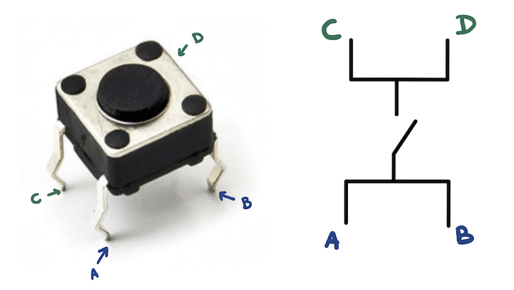
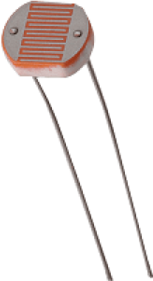

## De Drukknop

In dit gedeelte leer je een LEDje bedienen met een drukknop. Het type drukknop die wij gaan gebruiken heeft 4 pinnen - de twee pinnen die in het blauw zijn aangeduid zijn steeds onderling verbonden, net zoals de twee groene. Wanneer de knop wordt ingedrukt zullen de overige onderbroken pinnen ook verbinding maken. Je gebruikt dus een blauwe en een groene pin, bijvoorbeeld A en C.

Maak nu onderstaande schakeling na. 

De bijhorende code kan op de Arduino IDE bekomen worden door te navigeren naar File > Examples > 02.Digital > Button of kan [hier](https://github.com/Jeugdwerking-FLEM/introductie-arduino/tree/main/code-2-schakelaar/drukknop) bekeken worden. 

De drukknop wordt geïnstantieerd als input en het LEDje als output. De status van de knop wordt ingelezen en in de variabele `buttonState` gestoken. Als deze op 'HIGH' staat, en dus de knop wordt ingedrukt, zal het LEDje branden. Anders niet!

Naast een drukknop kan je bijvoorbeeld ook een LDR gebruiken. LDR staat voor 'Light Dependent Resistor' - dit is dus een lichtgevoelige weerstand. Dit wil zeggen dat de waarde van de weerstand afhankelijk is van de hoeveelheid licht die erop schijnt. Hoe meer licht, hoe lager de weerstand. Links wordt zo'n LDR afgebeeld.

In het volgende projectje zal de waarde van de LDR uitgelezen worden door de Arduino. Met behulp van 5 LEDjes zullen we de waarde weergeven: hoe meer licht de LDR opvangt, hoe meer LEDjes er zullen branden. Voor de LEDjes gebruiken we, zoals de vorige keren, digitale pinnen. Voor de LDR hebben we nu een analoge pin nodig: we gaan hier pin A0 gebruiken. 

De schakeling is hieronder weergegeven, en de bijhorende code kan [hier](https://github.com/Jeugdwerking-FLEM/introductie-arduino/tree/main/code-2-schakelaar/LDR) bekeken worden.

